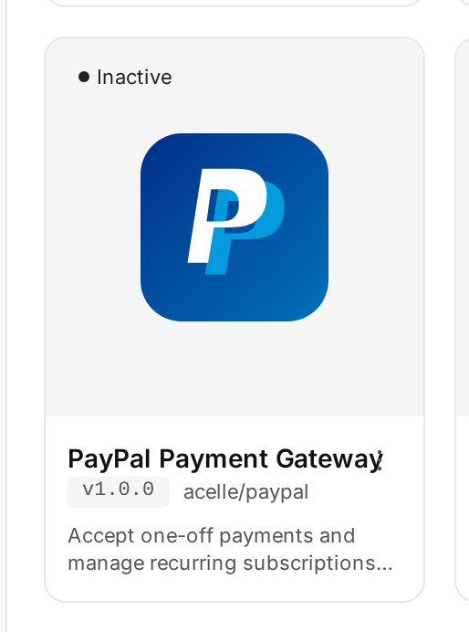
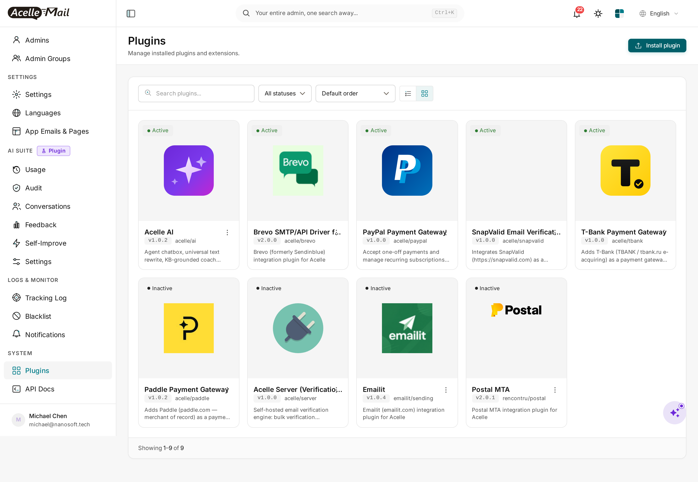
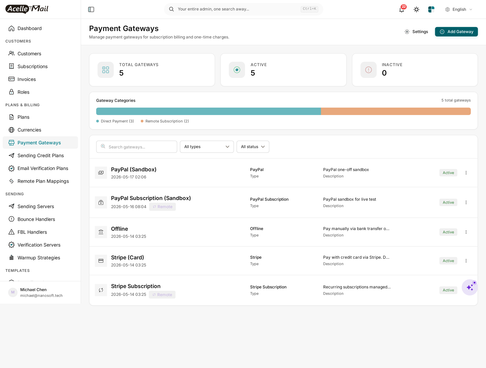
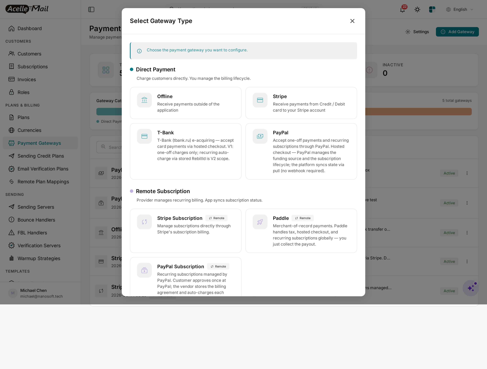
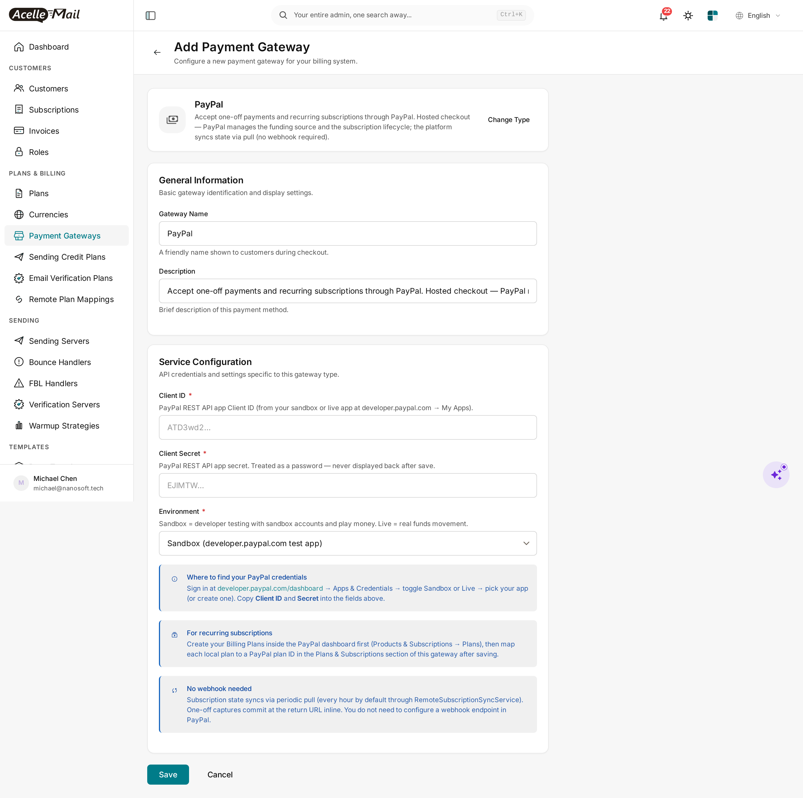

# PayPal for Acelle Mail — User Guide

A drop-in plugin that adds **PayPal** (paypal.com) to Acelle as a single gateway that handles **both**:

- **One-off charges** via PayPal **Orders v2** — the buyer pays once with their PayPal account OR as a guest with a debit/credit card (no PayPal account required).
- **Provider-managed subscriptions** via PayPal **Subscriptions v1** — the buyer approves once, then PayPal auto-charges each cycle against a PayPal **Billing Plan** you map your local plan to.

Which mode runs is decided automatically per checkout: a one-time invoice → one-off charge; a subscription plan → a PayPal subscription.

> **Pull-only completion.** No webhook endpoint to expose. The platform confirms each payment / subscription on the buyer's return from PayPal (with a background poll as backup) — no HMAC verification, no public callback URL.

---

## Table of Contents

1. [Requirements](#1-requirements)
2. [Install the plugin](#2-install-the-plugin)
3. [Enable the plugin](#3-enable-the-plugin)
4. [Add PayPal as a payment gateway](#4-add-paypal-as-a-payment-gateway)
5. [Configure Client ID + Secret + Environment](#5-configure-client-id--secret--environment)
6. [Map local plans to PayPal Billing Plans (subscriptions)](#6-map-local-plans-to-paypal-billing-plans-subscriptions)
7. [How customers pay](#7-how-customers-pay)
8. [Subscription state sync](#8-subscription-state-sync)
9. [Sandbox testing](#9-sandbox-testing)
10. [Troubleshooting](#10-troubleshooting)
11. [Uninstall](#11-uninstall)

---

## 1. Requirements

| | Minimum |
|---|---|
| **Acelle Mail** | 4.0.24 or newer |
| **PHP** | 8.1+ (matches Acelle's own minimum) |
| **PayPal account** | A PayPal Business account at [paypal.com](https://www.paypal.com/business) (free signup). A free **Sandbox** is included for testing. |
| **REST API app** | Create one at [developer.paypal.com/dashboard](https://developer.paypal.com/dashboard/) → **Apps & Credentials**. It produces a **Client ID** + **Secret** — the only two credentials this plugin needs. |
| **PayPal Billing Plans** | *For subscriptions only* — a Product + Billing Plan per local plan you sell recurring (see [§6](#6-map-local-plans-to-paypal-billing-plans-subscriptions)). One-off charges need none. |
| **Outbound HTTPS** | Server must reach `api-m.sandbox.paypal.com` (sandbox) and `api-m.paypal.com` (live) on port 443 |
| **Inbound HTTPS** | Your Acelle install must be reachable so buyers can be redirected back from PayPal (`/cashier/paypal/return/{intent_uid}`) |

You do **not** need a public webhook endpoint or IPN — completion is pull-based.

---

## 2. Install the plugin

Standard Acelle plugin install — admin → Plugins → upload ZIP.

1. Download the plugin ZIP from your account's **Plugins** page (`acelle-paypal-v1.2.x.zip`).
2. In the admin sidebar, open **System → Plugins**.
3. Click **Install plugin**, drop in the ZIP, and click **Upload & install**.


After install, **PayPal Payment Gateway** appears as **Inactive**:


---

## 3. Enable the plugin

1. In the **Plugins** list, find the **PayPal Payment Gateway** card.
2. Click the **⋮** menu and pick **Enable**.



The card flips to **Active** and the PayPal gateway becomes available in the gateway picker:



> **Disable** removes PayPal from the picker but keeps existing `payment_gateways` rows of type `paypal`. **Delete** rolls back migrations and removes files — see [§11](#11-uninstall).

---

## 4. Add PayPal as a payment gateway

1. In the admin sidebar, open **Plans & Billing → Payment Gateways**.
2. Click **+ Add Gateway**.



3. Pick **PayPal** from the picker:



> PayPal is a **single** gateway that serves both one-off and subscription plans — you do **not** register two separate gateways. Because it can host provider-managed subscriptions, it is grouped with the **Remote Subscription** gateways (same as Stripe), but it still charges one-off invoices too.

---

## 5. Configure Client ID + Secret + Environment



| Field | Value |
|---|---|
| **Gateway Name** | What customers see at checkout (e.g. `Pay with PayPal`) |
| **Description** | Free-form. Optional. |
| **Client ID** | The `ATD3wd2…` Client ID from your PayPal REST app. |
| **Client Secret** | The `EJlMTW…` Secret from the same app. Treated as a password. |
| **Environment** | `Sandbox` (test) or `Live` (real funds). |


> **Client ID and Secret are environment-bound.** A Sandbox key will not authenticate against Live and vice versa. If PayPal returns `Authentication failed` after save, check the Sandbox/Live toggle matches the dropdown.

> **No webhook URL to register.** Once saved you're done — completion is pull-based.

---

## 6. Map local plans to PayPal Billing Plans (subscriptions)

**This section applies only if you sell recurring plans through PayPal.** One-off charges need no mapping — they bill the invoice amount directly.

For a subscription, PayPal is the merchant of record for the recurring billing, so the plan must exist at PayPal as a **Billing Plan** (`P-…`):

1. **Create the PayPal Billing Plan.** At [paypal.com](https://www.paypal.com) → **Pay & Get Paid → Subscriptions → Plans → Create plan** (or via the API): pick/create a Product, set the billing cycle (e.g. monthly USD 10.00), save. PayPal assigns an id like `P-5ML4271244454362WXNWU5NQ`.
2. **Map it in Acelle.** Open your PayPal gateway → **Plans & Subscriptions → Remote Plan Mapping**. For each local plan you offer recurring through PayPal, pick the matching `P-…` plan (the dropdown is fetched live from PayPal). Save.

When a customer subscribes to that local plan via PayPal, the plugin starts a PayPal subscription against the mapped `P-…` and PayPal handles the recurring billing thereafter.

> **Unmapped local plan + customer subscribes:** the checkout fails loud (`requires a mapped PayPal Billing Plan id`). Map every local plan you offer recurring through PayPal before enabling it.

---

## 7. How customers pay

### One-off (a one-time invoice)

```
GET /cashier/paypal/checkout/{intent_uid}?return_url=…
```

1. The plugin creates a PayPal **Order** (`POST /v2/checkout/orders`) and 302-redirects the buyer to PayPal's approve page.
2. The buyer approves (PayPal account or guest card) and returns.
3. The plugin **captures** the order (`/capture`) inline — money lands in your balance, the `PaymentIntent` flips to `SUCCEEDED`, the plan term starts.

### Subscription (a recurring plan)

```
GET /cashier/paypal/checkout/{intent_uid}?return_url=…   (same route — mode chosen by the plan)
```

1. The plugin creates a PayPal **Subscription** (`POST /v1/billing/subscriptions`) against the mapped `P-…` plan and 302-redirects the buyer to PayPal's approve page.
2. The buyer approves (a PayPal account is required — recurring billing needs a stored agreement).
3. On return, the platform polls the subscription until it is **ACTIVE**, then activates the local subscription. Subsequent renewals are charged by PayPal and picked up by the periodic sync ([§8](#8-subscription-state-sync)).

If the buyer cancels at PayPal's approve page they return with `?cancel=1` and the intent is marked failed — the payment page shows the reason.

---

## 8. Subscription state sync

For a subscription, PayPal owns the lifecycle (renewals, cancellations, failures). Acelle pulls state on demand:

| Trigger | When | What it does |
|---|---|---|
| **Per-page lazy fetch** | Admin/customer opens a subscription page | `GET /v1/billing/subscriptions/{id}` → latest status, next-bill date, card |
| **Periodic sync job** | Hourly (Acelle scheduler) | Walks each local subscription **by id** and refreshes its state + billing history |
| **Manual "Refresh"** | Admin clicks Refresh | Forces a fresh fetch |

> **PayPal has no "list all subscriptions" API**, so the admin *browse-all-remote-subscriptions* overview is empty for PayPal — but every per-subscription sync works (the platform reconciles by id, not by enumerating). Cancelling a PayPal subscription is **immediate** (PayPal has no cancel-at-period-end), and there is no proration *preview* (a plan change quotes the new plan's price, then PayPal prorates on its side).

The one-off lane needs no sync — each capture completes inline at the return URL.

---

## 9. Sandbox testing

1. Go to [developer.paypal.com/dashboard](https://developer.paypal.com/dashboard/) → **Sandbox → Accounts**. Note the **personal** account's email — that's the buyer you'll use.
2. In your Acelle PayPal gateway, choose **Environment = Sandbox** and the **Sandbox** Client ID / Secret.
3. For subscription testing, create at least one **Sandbox** Product + Billing Plan and map it to a local plan ([§6](#6-map-local-plans-to-paypal-billing-plans-subscriptions)).
4. At checkout, sign in with the personal sandbox account and approve.

> Sandbox occasionally returns `INTERNAL_SERVICE_ERROR` on the first request after idle — retry once.

---

## 10. Troubleshooting

| Symptom | Likely cause | Fix |
|---|---|---|
| "Authentication failed" on save | Environment ↔ Client ID mismatch | Sandbox creds + Sandbox dropdown; Live creds + Live dropdown |
| `requires a mapped PayPal Billing Plan id` at checkout | Local plan not mapped to a `P-…` plan | Map it (see [§6](#6-map-local-plans-to-paypal-billing-plans-subscriptions)) |
| Buyer lands on a PayPal error page | Currency unsupported / amount below minimum, or the Billing Plan is not `ACTIVE` | Check the plan is active + the currency is supported |
| Subscription stays "Pending" after approve | Buyer closed the tab before returning, or the sync cron isn't running | Run `php artisan schedule:run`; the sub becomes active on the next poll |
| `cURL error 28: timed out` | Firewall blocks PayPal API hosts | Open port 443 to `api-m.paypal.com` + `api-m.sandbox.paypal.com` |
| PayPal missing from the gateway picker after enable | Stale opcache / view cache | `php artisan optimize:clear` |

The plugin logs its HTTP calls to `storage/logs/laravel.log` with the full PayPal response body on failure.

---

## 11. Uninstall

1. Open **System → Plugins**, find **PayPal Payment Gateway**, click **⋮ → Disable**. PayPal disappears from the picker; existing `payment_gateways` rows of type `paypal` are kept.
2. **⋮ → Delete** also rolls back migrations and removes the on-disk folder.

The core Acelle install is left as it was. The PayPal app in your developer dashboard is unaffected.

---

## Support

- **Documentation:** this guide + the comment header at the top of every plugin source file
- Questions & issues: contact **support@acellemail.com**

For PayPal account, payout, or app-credential questions, contact PayPal merchant support — out of scope for this plugin.
