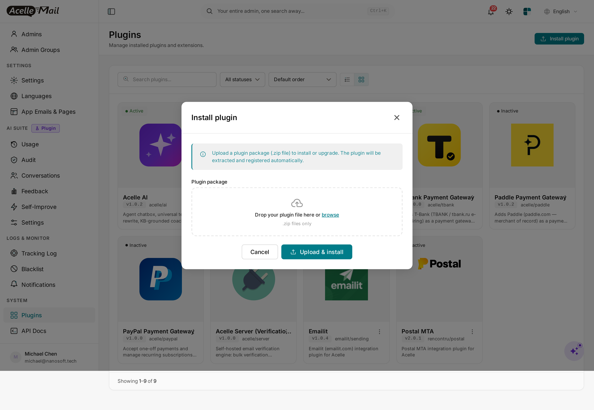
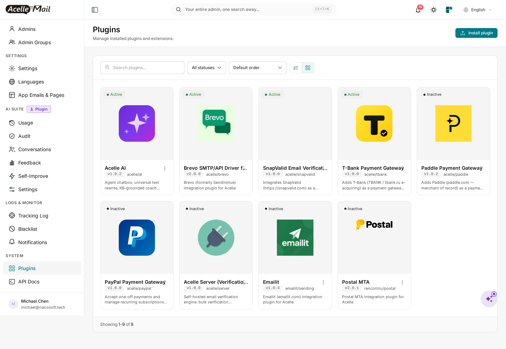
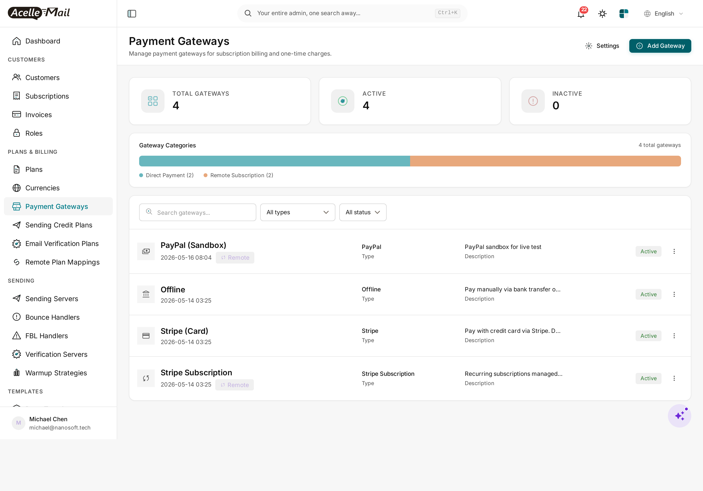
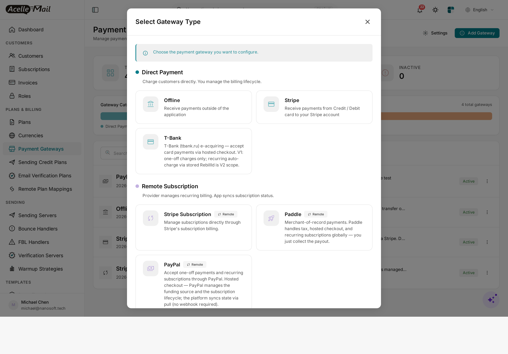
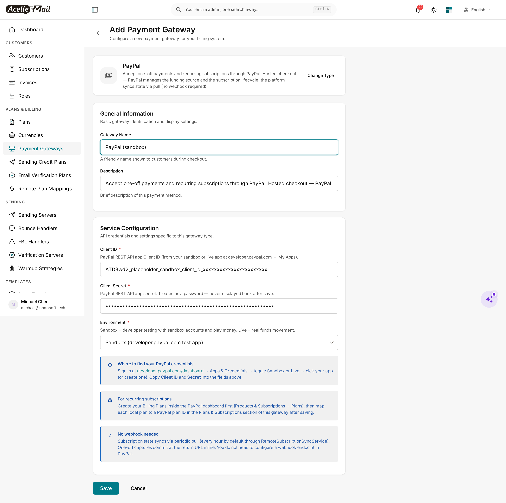

# PayPal Payment Gateway for Acelle Mail — User Guide

A drop-in plugin that adds **PayPal** (paypal.com) as a payment gateway in Acelle. Customers can pay with their existing PayPal balance, credit card, or local payment method through PayPal's hosted checkout. Supports both **one-off charges** (PayPal Orders v2) and **recurring subscriptions** (PayPal Billing Subscriptions v1) — and like Paddle, the integration is **pull-only**: no public webhook endpoint to host.

---

## Table of Contents

1. [Requirements](#1-requirements)
2. [Install the plugin](#2-install-the-plugin)
3. [Enable the plugin](#3-enable-the-plugin)
4. [Add PayPal as a payment gateway](#4-add-paypal-as-a-payment-gateway)
5. [Configure Client ID + Secret + Environment](#5-configure-client-id-secret-environment)
6. [Map your local plans to PayPal Billing Plans](#6-map-your-local-plans-to-paypal-billing-plans)
7. [How customers pay](#7-how-customers-pay)
8. [Subscription state sync](#8-subscription-state-sync)
9. [Sandbox testing](#9-sandbox-testing)
10. [Troubleshooting](#10-troubleshooting)
11. [Uninstall](#11-uninstall)

---

## 1. Requirements

| | Minimum |
|---|---|
| **Acelle Mail** | 4.0.24 or newer |
| **PHP** | 8.1+ (matches Acelle's own minimum) |
| **PayPal account** | A PayPal Business account at [paypal.com](https://www.paypal.com/business) (free signup). A free **Sandbox** is included for testing. |
| **REST API app** | Create one at [developer.paypal.com/dashboard](https://developer.paypal.com/dashboard/) → **Apps & Credentials**. The app produces a **Client ID** and **Secret** — the only two credentials this plugin needs. |
| **Outbound HTTPS** | Server must reach `api-m.sandbox.paypal.com` (sandbox) and `api-m.paypal.com` (live) on port 443 |
| **Inbound HTTPS** | Your Acelle install must be reachable so customers can be redirected back from PayPal after approve / cancel (`/cashier/paypal/return/{intent_uid}`) |

You do **not** need:
- A public webhook endpoint or webhook configuration in PayPal's dashboard
- IPN (Instant Payment Notification) — that's a legacy push protocol; this plugin uses the modern pull model
- Cron beyond Acelle's existing scheduler (subscription sync runs inside `php artisan schedule:run`)

---

## 2. Install the plugin

Standard Acelle plugin install — admin → Plugins → upload ZIP.

**Steps**

1. Download the plugin ZIP from CodeCanyon (file name: `acelle-paypal-v1.0.x.zip`).
2. In the admin sidebar, open **System → Plugins**.
3. Click **Install plugin** in the top right.
4. Drop the ZIP into the upload box (or click **Choose File**) and click **Upload & install**.

The progress dialog runs through three steps — *Uploading package → Extracting + writing files → Registering plugin + running install routines* — and finishes in 5–30 seconds.



After install completes, the **Plugins** list reloads and **PayPal Payment Gateway** appears as **Inactive**:



---

## 3. Enable the plugin

Installing only registers the plugin on disk; enable it explicitly so you stay in control of which gateways are available.

**Steps**

1. In the **Plugins** list, find the **PayPal Payment Gateway** card.
2. Click the **⋮** (kebab) menu in the card's top-right and pick **Enable**.


The card flips to **Active**:


> **Disable** removes PayPal from the gateway picker for new gateways but keeps existing `payment_gateways` rows of type `paypal`. **Delete** also drops every PayPal gateway row — see [§11](#11-uninstall).

---

## 4. Add PayPal as a payment gateway

Now that the plugin is active, you can register your PayPal app as one of your billing gateways.

**Steps**

1. In the admin sidebar, open **Plans & Billing → Payment Gateways**.
2. Click **+ Add Gateway** in the top right.



3. The gateway picker opens. Pick **PayPal** from the **Remote Subscription** group:



> PayPal is in **Remote Subscription** because the subscription lifecycle is owned by PayPal (their Billing Subscriptions API), not Acelle. This is the same group as Paddle and Stripe Subscription. (The "Direct Payment" group above — Offline, Stripe card-token, T-Bank — covers gateways where Acelle owns the subscription record.)

---

## 5. Configure Client ID + Secret + Environment

After picking PayPal, you land on the configuration form.


Fill in these fields:

| Field | Value |
|---|---|
| **Gateway Name** | What customers see at checkout (e.g. `PayPal`, `Pay with PayPal`) |
| **Description** | Free-form. Optional. |
| **Client ID** | The `ATD3wd2…` Client ID from your PayPal REST app. Get it from **developer.paypal.com/dashboard** → Apps & Credentials → toggle Sandbox or Live → pick your app. |
| **Client Secret** | The `EJlMTW…` Secret from the same app. Treated as a password and never displayed back after save. |
| **Environment** | `Sandbox` (developer testing with sandbox accounts and play money) or `Live` (real funds movement). |



> **Client ID and Secret are environment-bound.** A Sandbox Client ID will NOT authenticate against the Live API and vice versa. Mixing them is the most common mistake — if PayPal returns `Authentication failed` after save, double-check the Sandbox/Live toggle in the PayPal dashboard matches the dropdown value here.

Click **Save**. The plugin runs an immediate `POST /v1/oauth2/token` call against the chosen environment as a connection test — if credentials are wrong, you'll see the error inline and the gateway is **not** saved.

> **No webhook URL to register.** Once the gateway is saved you're done — no callback URL to copy into the PayPal dashboard, no `webhook_id` to paste back, no event subscriptions to configure. State syncs in the other direction (Acelle pulls from PayPal on a schedule — see [§8](#8-subscription-state-sync)).

---

## 6. Map your local plans to PayPal Billing Plans

For **one-off charges** (a customer paying upfront for a single subscription term), no mapping is needed — the plugin creates the Order on the fly with the local plan's price.

For **recurring subscriptions** (auto-renewal at the end of each term), you must map each local Acelle plan to a **PayPal Billing Plan** (PayPal's own plan resource).

**Steps**

1. **Create the PayPal Billing Plan first.** Log in at [paypal.com](https://www.paypal.com) → **Pay & Get Paid → Subscriptions → Plans → Create plan**. Pick a product, set the billing cycle (e.g. monthly USD 49.00), save. PayPal gives the plan an id like `P-5ML4271244454362WXNWU5NQ`.
2. **Map it in Acelle.** Open your Acelle PayPal gateway → **Plans & Subscriptions → Remote Plan Mapping**. For each local plan you want to offer through PayPal, pick the corresponding `P-…` plan id from the dropdown (which is fetched live from `GET /v1/billing/plans` at PayPal).
3. **Save the mapping.** Acelle now knows that "local plan X = PayPal plan P-…".

When a customer subscribes to local plan X, the plugin starts a PayPal subscription against `P-…` and PayPal handles the recurring billing forever after.

> **Why do I have to create plans at PayPal too?** PayPal's recurring billing requires their resource model: a Product → a Plan → a Subscription. Acelle wraps the Subscription end of that and stores the plan-to-plan mapping, but the Plan resource itself must exist at PayPal because PayPal is the merchant of record for recurring charges.

---

## 7. How customers pay

When a customer picks PayPal at checkout, Acelle redirects them through a single plugin route:

```
GET /cashier/paypal/checkout/{intent_uid}?return_url=…
```

The handler:

1. Looks up the `PaymentIntent` and decides the path — one-off or subscription based on the intent type.
2. **One-off**: calls PayPal's `POST /v2/checkout/orders` with the line items + return / cancel URLs.
3. **Subscription**: calls PayPal's `POST /v1/billing/subscriptions` against the mapped Plan id + return / cancel URLs.
4. Receives an `approve` URL back from PayPal.
5. Issues a 302 redirect to that hosted-checkout URL.

The customer pays on PayPal's hosted page (PayPal handles fraud screening, 2FA, currency conversion, local payment methods) and is sent back to:

```
GET /cashier/paypal/return/{intent_uid}?token=…           # one-off approved
GET /cashier/paypal/return/{intent_uid}?subscription_id=…  # subscription approved
GET /cashier/paypal/return/{intent_uid}?cancel=1           # customer cancelled
```

For **one-off**, the return handler calls `POST /v2/checkout/orders/{id}/capture` inline (commits the money) and flips the `PaymentIntent` to `SUCCEEDED`. For **subscription**, the return handler stores the PayPal subscription id and marks the local subscription `active`; subsequent renewals are detected by the periodic sync ([§8](#8-subscription-state-sync)).

> **There is no headless / in-app checkout.** PayPal requires their hosted approve flow for SCA / 3DS / 2FA. The plugin's `createSubscription` headless method ([for plans that want it] e.g. with a stored Vault payment method) is reserved for advanced future use.

---

## 8. Subscription state sync

Once a customer activates a subscription, PayPal owns its lifecycle (renewals, cancellations, failures, refunds). Acelle pulls state on demand.

Three sync triggers:

| Trigger | When | What it does |
|---|---|---|
| **Per-page lazy fetch** | Admin or customer opens a subscription detail page | Calls `GET /v1/billing/subscriptions/{id}` and renders the latest status, next-bill-date, and payment-method preview directly |
| **Periodic sync job** | Hourly by default (Acelle scheduler) | `RemoteSubscriptionSyncService` walks every active remote sub through this gateway, fetches state, and dispatches lifecycle events (`onSubscriptionRenewed`, `onSubscriptionCancelled`, `onPaymentFailed` …) |
| **Manual "Refresh"** | Admin clicks the Refresh button on a subscription page | Forces a fresh fetch bypassing any cache |

Because the architecture is pull-not-push, state lags reality by at most one sync interval (typically minutes). For SaaS billing this is fine — the customer doesn't see the new sub status the literal microsecond PayPal confirms it; they see it on the next page render or the next periodic tick.

---

## 9. Sandbox testing

PayPal Sandbox is fully isolated from Live — separate accounts, separate balances, separate API hosts.

**Steps**

1. Go to [developer.paypal.com/dashboard](https://developer.paypal.com/dashboard/) → **Sandbox → Accounts**. PayPal gives you 2 default sandbox accounts (one business, one personal).
2. Note the **personal** account's email — that's the buyer you'll use to "pay" in test transactions.
3. In your Acelle PayPal gateway, choose **Environment = Sandbox** and use the **Sandbox** Client ID / Secret.
4. At checkout, sign in with the personal sandbox account email when redirected to PayPal.

You can create additional sandbox accounts in different currencies / countries from the same dashboard — useful for testing currency conversion and country-restricted scenarios.

> **Sandbox sometimes returns `INTERNAL_SERVICE_ERROR`** on first request after a long quiet period — PayPal's sandbox cold-starts. Retry once.

---

## 10. Troubleshooting

| Symptom | Likely cause | Fix |
|---|---|---|
| "Authentication failed" on save | Environment ↔ Client ID mismatch | Sandbox creds + Sandbox dropdown; Live creds + Live dropdown — don't mix |
| Customer lands on PayPal error page | Currency unsupported for the buyer's country, or amount below PayPal's per-currency minimum | Check the order currency is in PayPal's supported list (USD, EUR, GBP, JPY, AUD, CAD, etc.) and the amount is above minimum (1¢ for most) |
| Subscription stays "Pending" after approve | The customer cancelled at PayPal's approve page (browser returned but with `?cancel=1`) | Check the PaymentIntent — if the return-handler saw `cancel=1`, the intent is marked CANCELLED. If status is stuck PENDING, the customer closed the tab without approving |
| Renewals not appearing in Acelle | Sync cron not running, or PayPal subscription was cancelled outside Acelle | Run `php artisan schedule:run` manually; check the sub status at PayPal → Subscriptions |
| `cURL error 28: Operation timed out` | Outbound firewall blocks PayPal API hosts | Open port 443 to `api-m.paypal.com` and `api-m.sandbox.paypal.com` |
| `Plan not found` when subscribing | Local plan not mapped to a PayPal Plan id | Map at gateway → Plans & Subscriptions → Remote Plan Mapping ([§6](#6-map-your-local-plans-to-paypal-billing-plans)) |
| Plugin shows Active but PayPal missing from gateway picker | Stale opcache / view cache | `php artisan optimize:clear` and reload |

For everything else, the plugin's HTTP calls log to `storage/logs/laravel.log` at `info` on success and `error` on failure with the full PayPal response body inline.

---

## 11. Uninstall

1. Open **System → Plugins**.
2. Find **PayPal Payment Gateway**, click the **⋮** menu and pick **Disable**. The PayPal gateway type immediately disappears from the admin gateway picker — existing `payment_gateways` rows of type `paypal` are kept (so you don't lose audit history).
3. To also remove the plugin files: same menu → **Delete**. This rolls back the plugin's migrations and removes the on-disk folder.

The core Acelle install is left exactly as it was. The PayPal app in your developer dashboard is unaffected — feel free to keep it for later use or delete it from PayPal's dashboard if you no longer need it.

---

## Support

- **Documentation:** this guide + the comment header at the top of every plugin source file
- **Issue tracker / questions:** the CodeCanyon item comments page
- **Direct contact:** see the **Author** column on the CodeCanyon item page

For PayPal account, payout, app-credential, or business-verification questions, please contact PayPal merchant support directly — those are out of scope for this plugin.
